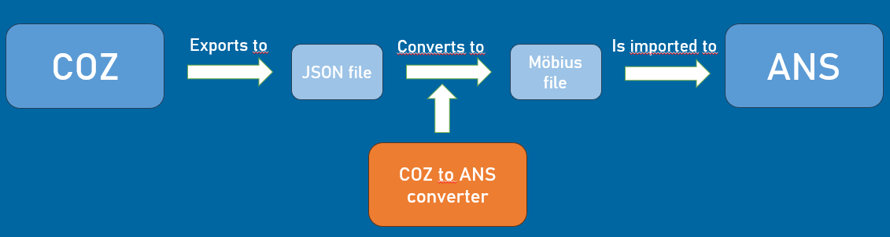
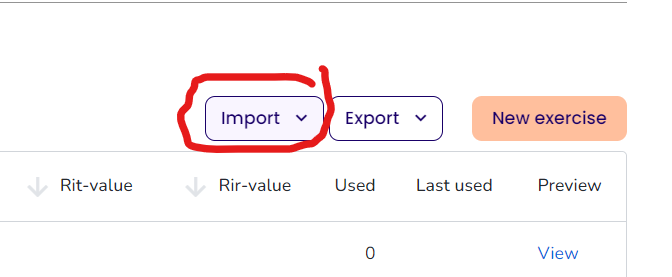

# The COZ to ANS converter

This is a program that helps you transferring question databases made in the COZ media editor to the [ANS assessment platform](https://ans.app/landing).

## Description

Transferring questions from COZ to ANS needs to be done in a rather roundabout way. As ANS cannot directly import the json file as outputted by COZ, this program converts this json file to the XML format of [Möbius](https://www.digitaled.com/mobius/) assessments, which in turn can then be uploaded to ANS. 
In short, the flow is as follows:

## Getting Started

### Dependencies

This project uses several python libraries. Below we have provided the instructions on how to install these using the Anaconda package installer. However, you can always use another package manager if needed.

* [Pandas](https://pandas.pydata.org/docs/getting_started/install.html)
  ```
  conda install -c anaconda pandas
  ```
* [Openpyxl]()
  ```
  conda install -c anaconda openpyxl
  ```

* [Lxml](https://anaconda.org/anaconda/lxml)
  ```
  conda install -c anaconda lxml
  ```

* [Rapidjson](https://pypi.org/project/python-rapidjson/)
  ```
  conda install -c conda-forge python-rapidjson
  ```

### Installing

1. Clone the repo
   ```sh
   git clone INSERT REPONAME
   ```
2. Install python dependencies
3. Configure your settings in run.js

### Executing the program
1. Export the question database that you want to transfer to a .json file with the COZ Media Editor
2. Specify the location of your json file in main/run.js by setting the `input_file` variable
3. Specify the target directory for your Möbius output, or leave it to its default position in data/output
4. Run main/run.js in a python console. There will now appear 3 different outputs in your target directory:
   1. main: a directory containing the Möbius output
   2. main.zip: a zipped version of the main directory
   3. problems.xlsx: an excel showing the questions that could not be properly converted, due to a lack of support by this tool, or by ANS
5. You can now upload your questions to ANS by choosing the "Möbius import" option in your question bank and selecting the zipped version of the main file from your computer.
  


## Author

Do you have a question? Feel free to send an email to Marijn Roelvink ([marijn.roelvink@hotmail.com](mailto:marijn.roelvink@hotmail.com)).

Thanks to Tom van Woudenberg for testing and support!

## License

This project is licensed under the Creative Commons Attribution-NonCommercial-ShareAlike 4.0 International Public License - see the LICENSE.md file for details
